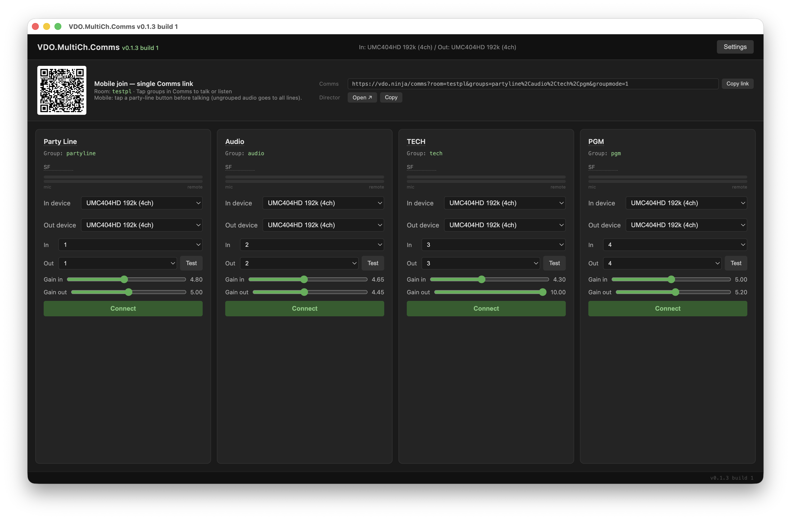

# VDO.MultiCh.Comms

> **Alpha — v0.1.4.** Not production-ready. Expect rough edges.

Multi-channel IP intercom for live production. Run up to four independent party lines through a single [VDO.ninja](https://vdo.ninja) Comms room, each routed to a dedicated channel on a hardware audio interface — no separate daemon, no account, no app install for remote participants.

**Primary use case:** bridging two buildings with hardware intercom systems over WAN (ISDN/IP replacement). Works equally well on LAN.



---

## Install

1. Download `VDO.MultiCh.Comms-0.1.4-arm64.dmg` from the [Releases page](https://github.com/TomsFaire/VDO.MultiCh.Comms/releases)
2. Mount the DMG and drag the app to Applications
3. **Right-click → Open** on first launch — the app is ad-hoc signed but not notarized; Gatekeeper blocks a normal double-click until you explicitly allow it

No Rust or Node.js required for end users.

---

## How to use

### First launch

The setup wizard creates your config: give the event a name, name your party lines (Party Line, Audio, Tech, PGM, etc.), and pick your audio interface. Config is saved to `~/.vdo-multichan/config.json`.

### Connecting a party line

Each party line card on the main screen has:

- **In device / Out device** — the CoreAudio input and output interface for that line
- **In / Out channel** — which channel on that interface to use
- **Gain in / Gain out** — adjustable per line (up to 10×, ~+20 dB)
- **Level meters** — mic (left) and remote (right); yellow at 60%, red at 95%
- **Test** — plays a short tone to verify the output route
- **Connect** — joins the VDO.ninja room for that line

Press **Connect** on each line you want active. The status bar at the top shows the current global audio device.

### Remote participants (mobile / browser)

At the top of the window, the **Comms** QR code and link give remote participants access to all party lines from any mobile browser — no app install required.

1. Scan the QR code or share the Comms link
2. Allow microphone access when prompted
3. Tap the party line button to talk on that line (ungrouped audio is heard on all lines)

The **Director** link opens a view covering all groups in the room.

### Settings

Click **Settings** (top-right) to change the room name, toggle room lock (prevents new participants from joining), or update global audio device settings.

For a full walkthrough see [docs/usage.md](docs/usage.md).

---

## What's new in v0.1.4

- **Room name editable from Settings** — change the VDO.ninja room name without editing config manually
- **Room lock** — toggle in the comms bar to exclude new joiners from an active session

### Also in v0.1.3

- **Per-PL audio device selection** — each party line can use its own input and output interface
- **Audio bleed fixes** — VDO.ninja media elements muted in shim; remote audio can't leak through system speakers
- **Gain range** — sliders raised to 10× (~+20 dB); red meter threshold at 95%
- **Level meters** — mic (green) and remote (blue) level bars per line
- **WebRTC config unlocked** — LAN/WAN mode now user-configurable; WAN default (TURN/STUN enabled)
- **Audio stability** — save-config no longer restarts CoreAudio mid-session; gain sliders save on release

### Also in v0.1.1 (if upgrading from v0.1.0)

- **CoreAudio N-API addon** replaces the Rust CPAL shim — audio I/O runs in-process, no WebSocket on port 9696
- **Single Comms room + groups** — one mobile QR/link for the whole event; lines are VDO.ninja groups inside that room
- **Full duplex hardware routing** — remote audio returns to the configured output channel, not just system speakers
- **GitHub Actions releases** — tagged `v*.*.*` builds publish a signed DMG and SHA-256 checksums automatically

---

---

## For developers

### How it works

```
Hardware mic / BlackHole (CoreAudio)
  → coreaudio.node N-API addon (main process, per-channel capture)
  → Electron IPC (audio-frame per input channel)
  → Per-line preload (AudioWorklet getUserMedia override)
  → VDO.ninja push (group-scoped, single comms room)
  → WebRTC → remote participants (phone, web browser)

Remote audio (inbound)
  → VDO.ninja group-scoped playback in same session
  → DOM remote-tap + AudioWorklet (per-line preload, media elements muted)
  → Electron IPC (playback-frame)
  → coreaudio.node → hardware output channel
```

**Hardware I/O** runs in-process via a native **CoreAudio N-API addon** (`coreaudio.node`). Capture is clocked by the audio device callback; each input channel is forwarded over Electron IPC to the matching line's hidden `WebContentsView`.

**Per-PL sessions** — each line can optionally have its own dedicated input and output device (e.g. a USB headset per operator). When per-PL devices differ from the global device, a separate `startSession("pl-N", ...)` is opened for that line. Lines that share the global device use the shared session and are demultiplexed by channel index.

**VDO.ninja** uses a **single comms room** (`comms_room`) with **group mode** (`groupmode=1`). Each party line publishes to `push=<room>_<group>` and listens only within its group. Mobile clients open one `/comms?room=…&groups=…` link and pick a line button before talking.

---

### Status

| Feature | Status |
|---|---|
| First-run setup wizard (event name + line naming) | ✅ Done |
| Session export / import (base64 code) | ✅ Done |
| Single Comms room + per-line groups | ✅ Done |
| Per-line QR codes and join links | ✅ Done |
| Director link (all groups in one room) | ✅ Done |
| VDO.ninja WebContentsView auto-join (silent, audio-only) | ✅ Done |
| CoreAudio N-API capture + playback | ✅ Done |
| In-process IPC audio bridge (no WebSocket shim) | ✅ Done |
| Combined push + group listen in one view per line | ✅ Done |
| Per-PL audio device selection | ✅ Done (v0.1.3) |
| Live level meters (mic + remote, color-coded) | ✅ Done (v0.1.3) |
| Audio bleed isolation (shim element muting) | ✅ Done (v0.1.3) |
| LAN / WAN WebRTC mode (configurable) | ✅ Done (v0.1.3) |
| STUN/TURN (cross-NAT, WAN default) | ✅ Done (v0.1.3) |
| Room name editable from Settings | ✅ Done (v0.1.4) |
| Room lock (exclude new joiners) | ✅ Done (v0.1.4) |
| Device enumeration from CoreAudio (channel counts) | ✅ Done |
| Build number auto-bump + DMG packaging | ✅ Done |
| macOS TCC microphone permission | ✅ Done |
| Inbound audio (remote → hardware output channel) | ✅ Done |
| Outbound audio (hardware → VDO.ninja) | ✅ Done |
| Code signing | ⏳ Post-alpha |
| `session.setPreloads` → `registerPreloadScript` | ⏳ Low priority |

---

### Prerequisites

- macOS (Apple Silicon — arm64 DMG)
- Node.js 18+ and npm — to build the Electron app and native addon
- Xcode Command Line Tools — for `node-gyp` / CoreAudio N-API build
- A multi-channel audio interface (e.g. BlackHole, Focusrite Scarlett), or the Mac's built-in mic/speakers

---

### Getting started

Build from source or see [docs/development.md](docs/development.md) for CI and release tagging.

#### 1. Build the CoreAudio native addon

```bash
cd app/native
npm install
npm run build
# Output: app/native/build/Release/coreaudio.node
```

#### 2. Install and launch the Electron app (dev)

```bash
cd app
npm install
npm start
```

Config lives at `~/.vdo-multichan/config.json` and is created on first run.

#### 3. Build a distributable DMG

```bash
cd app/native && npm install && npm run build
cd .. && npm run build
# Output: app/dist/VDO.MultiCh.Comms-<version>-arm64.dmg
```

The app is unsigned — right-click → Open on first launch on any machine.

---

### Configuration

`~/.vdo-multichan/config.json` — written by the app UI, editable manually.

```json
{
  "instance_name": "studio-2026",
  "comms_room": "studio2026",
  "comms_password": "",
  "vdo_base_url": "https://vdo.ninja",
  "input_device_uid": "<CoreAudio device UID>",
  "output_device_uid": "<CoreAudio device UID>",
  "sample_rate": 48000,
  "webrtc_lan_mode": false,
  "lines": [
    { "id": 0, "name": "PL1", "group": "pl1", "input_channel": 0, "output_channel": 0, "gain_in": 1.0, "gain_out": 1.0, "input_device_uid": null, "output_device_uid": null },
    { "id": 1, "name": "PL2", "group": "pl2", "input_channel": 1, "output_channel": 1, "gain_in": 1.0, "gain_out": 1.0, "input_device_uid": null, "output_device_uid": null }
  ]
}
```

- **`comms_room`** — single VDO.ninja room shared by all lines and the mobile Comms UI.
- **`group`** (per line) — party-line identity inside that room; derived from the line name at setup.
- **`input_device_uid` / `output_device_uid`** (per line) — optional dedicated device for that PL. `null` falls back to the global device and channel index routing.
- **`webrtc_lan_mode`** — set to `true` to strip ICE servers from Electron views (suppresses TURN DNS errors on same-LAN shows). Default `false` (WAN/TURN enabled).
- Legacy configs with per-line `room_key` are migrated automatically into `comms_room` + `group`.

---

### Architecture notes

#### CoreAudio capture and playback

The N-API addon opens the configured input/output devices. The IO proc callback de-interleaves capture buffers and invokes a JS callback per channel. Playback uses per-output-channel ring buffers fed by `pushPlaybackSamples()` from the renderer preload's remote-tap path.

Per-PL device sessions are managed by `startSession(sessionId, capUid, capCh, pbUid, pbCh, cb)` / `stopSession(sessionId)`. Each session owns its own `AudioEngine` with independent ring buffers and HAL callback.

#### IPC audio bridge

Each active line registers its input channel in `channelViews` (shared session) or `sessionViews` (per-PL session). When a capture frame arrives, main process sends `audio-frame` over `webContents.send()` to the correct line's hidden view. The injected preload feeds an `AudioWorkletNode` ring buffer and resolves the `getUserMedia` override with a `MediaStreamDestination` stream.

Inbound remote audio is tapped from VDO.ninja media elements (which are immediately muted to prevent speaker bleed), batched in an AudioWorklet, and sent back via `playback-frame` IPC to the matching CoreAudio session and output channel.

#### Single room, grouped lines

- **Operator / mobile Comms:** `/comms?room=<comms_room>&groups=<g1>,<g2>,…&groupmode=1`
- **Per-line desktop push:** `room=<comms_room>&push=<comms_room>_<group>&group=<group>&groupmode=1`

One hidden `WebContentsView` per line handles both publish and group-scoped listen.

---

### Documentation

| Doc | Audience |
|-----|----------|
| [docs/usage.md](docs/usage.md) | End users — setup, Comms QR, audio devices, session codes |
| [docs/development.md](docs/development.md) | Developers — build from source, repo layout, architecture |
| [docs/self-hosting.md](docs/self-hosting.md) | Ops — self-hosted VDO.ninja, TURN, LAN vs cross-NAT |
| [docs/known-issues.md](docs/known-issues.md) | Status, resolved issues, open limitations |
| [docs/handoff.md](docs/handoff.md) | Maintainer handoff — config model, IPC flow, CI |

---

## Contributing

Alpha-stage project. Issues and PRs welcome. To build from source or cut a release, see [docs/development.md](docs/development.md).
